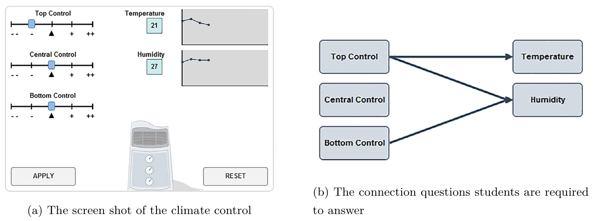
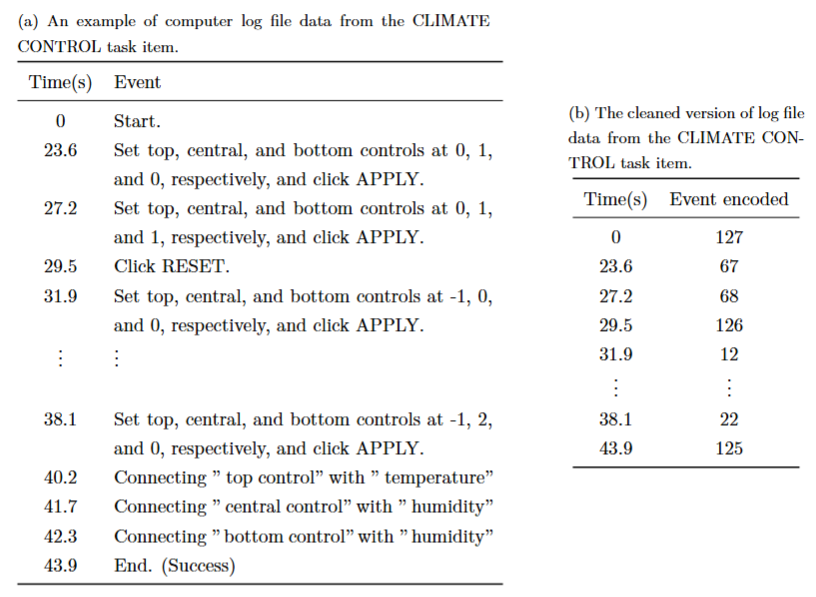
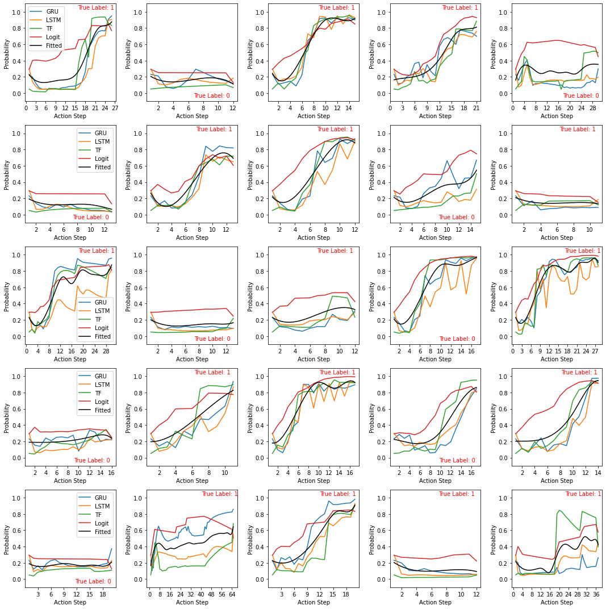
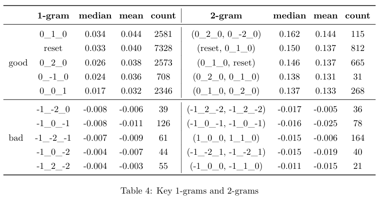
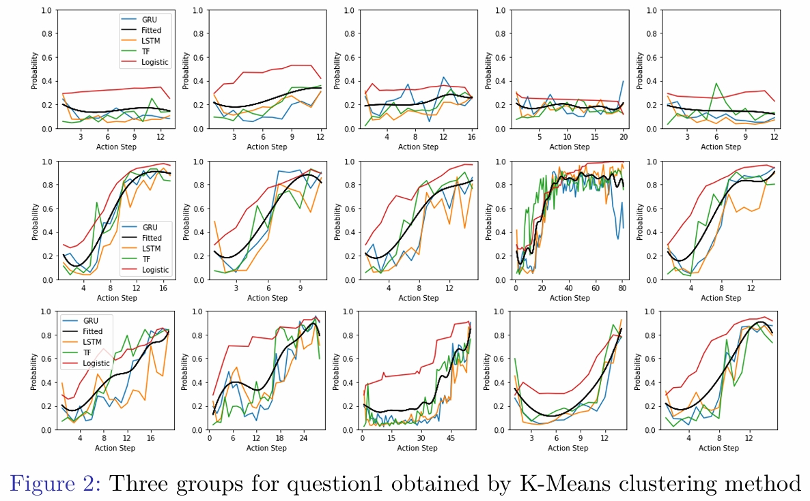
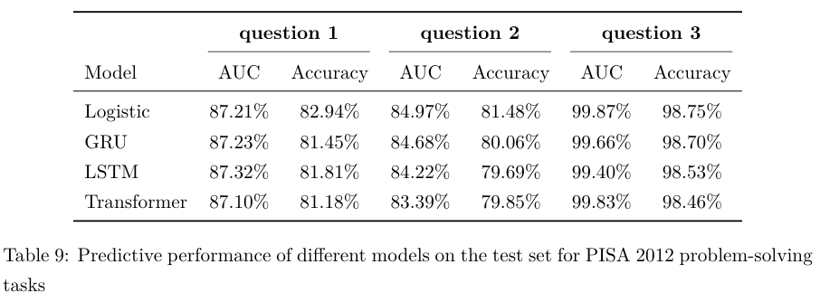
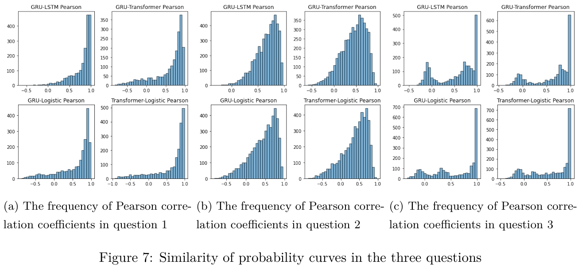

# Model-Agnostic Prediction Framework for CPS Process Data  

This repository contains the implementation of the models and the analysis framework presented in our paper **"An Implementation-Friendly Model-Agnostic Approach for Process Data Analysis."**  
It provides tools for analyzing CPS process data, fitting probability curves, and solving downstream tasks.  

---

## Features  
- Implements Logistic Regression, GRU, LSTM, and Transformer models for log file process data analysis.  
- Construct dynamic probability curves to characterize the complete response process of students and demonstrate that this characterization is model-free.
- Fits model outputs using B-splines for further estimation. 
- Applicable to a wide range of downstream tasks, such as individual classification and identification of key actions.
- Test on several questions of PISA 2012 problem-solving assesment and proves that the proposed framework is item-free, meaning it does not rely on question type or task-specific prior expert knowledge.

---

## Directory Structure  
```
.
├── data/               # Example raw data and porcessed input data
├── models/             # Model definitions (GRU, LSTM, Transformer and Logistic Regression)
├── utils/              # Utility functions
├── scripts/            # Scripts for data loading, training, evaluation, probability curve construction, and solving downstream tasks
├── results/            # Sample results for questions from PISA 2012
├── config.yaml         # Configuration file for model parameters, training, testing, and output settings
├── run_all.py          # Main script to execute all processes
├── README.md           # Project documentation
└── requirements.txt    # Python dependencies
```

---


## Quick Start  

### Installation  
1. Clone the repository:  
   ```bash
   git clone https://github.com/ruoxinyuan/cps-prediction.git
   cd cps-prediction
   ```
2. Install dependencies:  
   ```bash
   pip install -r requirements.txt
   ```  

### Example: Train Models  
Run the following command to train models on sample data:  
```bash
python scripts/train.py
```  
After training, the trained models will be saved in the `output/` folder for analysis.  

---

## Results  
### Sample Question: Climate Control

  

Data regarding students’ problem-solving processes were collected through computer log files, in the form of a sequence of time-stamped events.

  

### Probability Curves Generated

 

### Downstream Tasks

 

 

### Model-Agnostic

 

 

---

## Citation  
If you use this code or framework in your research, please cite our paper. 

---

## License  
This project is licensed under the Apache License. See the [LICENSE](LICENSE) file for details.  

